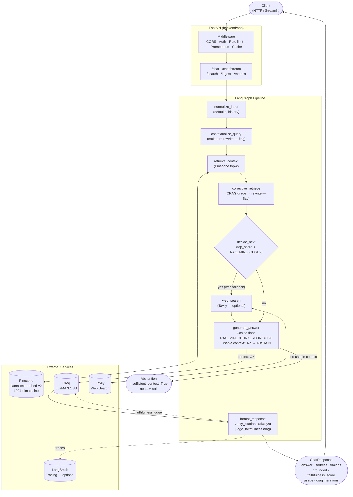

<div align="center">
  <h1>🧠 rag-agent-workbench</h1>
  <p><i>Production-style RAG backend with a 7-node LangGraph pipeline, cosine-gated abstention,
  corrective retrieval, two-layer faithfulness checking, and honest token streaming.</i></p>
</div>

<br>

<div align="center">
  
  
  
  
  
  
  
</div>

---

## What this is

An agentic RAG system built as a deliberate engineering exercise: every design decision is
measurement-driven, every limitation is documented, and every feature ships with a test.

**Stack:** FastAPI · LangGraph/LangChain · Pinecone (`llama-text-embed-v2`, 1024-dim) · Groq
(LLaMA 3.1 8B) · Tavily · Streamlit · Prometheus · Docker

**Standout decisions** (details in [`docs/DESIGN.md`](docs/DESIGN.md)):
- **Eval-first:** retrieval evaluation harness built before any parameter was tuned; labels
  set by reading documents, not by running the retriever (anti-circular-validation).
- **Reranking measured and disabled:** `bge-reranker-v2-m3` A/B tested — nDCG@3 fell 0.057,
  +435 ms latency, no tradeoff found. `RAG_RERANK_ENABLED=False` is empirically validated.
- **top_k=5, precision-first:** the recall-margin knee is k=8 (recall@8=0.97), but k=5
  (P@5=0.36 vs P@8=0.24) delivers higher-signal context. Tiebreaker: an answer-quality eval
  that doesn't yet exist.
- **Cosine floor = 0.20, data-derived:** set below the 0.2368 minimum cosine score of any
  golden-relevant chunk — a safety bound, not a tuned optimum.
- **Bounded CRAG:** hard `max_iters=2` loop guard, disabled by default on a saturated corpus.
- **Honest streaming:** `llm.astream` for real TTFT; cache hits and abstentions are served
  honestly with explicit `done.cached` / `insufficient_context` flags — never fake word-splits.

---

## Architecture



> **Node-to-code mapping:**
> `normalize_input` · `contextualize_query` · `retrieve_context` · `corrective_retrieve` ·
> `decide_next` · `generate_answer` · `format_response` — all in
> [`backend/app/services/chat/graph.py`](backend/app/services/chat/graph.py)

---

## Screenshot


---

## Getting Started

### Backend

```bash
cd backend
pip install -r requirements.txt
cp .env.example .env      # set PINECONE_*, GROQ_API_KEY; API_KEY optional
uvicorn app.main:app --port 8000
```

Browse: `http://localhost:8000/health` · `http://localhost:8000/docs`

### Frontend

```bash
pip install -r requirements.txt   # root (Streamlit)
streamlit run frontend/app.py
```

Set `BACKEND_BASE_URL` and (if the backend is protected) `API_KEY` in
`.streamlit/secrets.toml` or environment variables.

### Tests

```bash
pytest tests/ -v        # 343 tests, zero network, zero credentials
```

---

## Project Structure

```text
rag-agent-workbench/
├─ backend/
│  ├─ app/
│  │  ├─ routers/        # chat, search, ingest, metrics, health
│  │  ├─ services/       # chat/graph.py (LangGraph), pinecone_store, llm, rerank, crag, …
│  │  ├─ core/           # config, auth, cache, rate_limit, prometheus_metrics, …
│  │  └─ schemas/        # Pydantic models (ChatResponse, SourceHit, …)
│  ├─ requirements.in    # loose intent
│  └─ requirements.txt   # pinned lock (uv pip compile)
├─ frontend/app.py       # Streamlit chatbot UI
├─ eval/                 # retrieval harness, golden.jsonl, corpus manifest
├─ tests/                # 343 tests — unit + integration
├─ scripts/              # bench_local.py, bench_mocked.py, smoke tests
└─ docs/
   ├─ DESIGN.md          # ← design decisions + limitations (start here)
   ├─ CONTEXT.md         # full decision log, work package history, runbook
   └─ LOAD_TEST.md       # in-process benchmark report
```

---

## Documentation

| Document | What it covers |
|---|---|
| **[`docs/DESIGN.md`](docs/DESIGN.md)** | Design decisions, tradeoffs, limitations — the engineering story |
| [`docs/CONTEXT.md`](docs/CONTEXT.md) | Full decision log, eval results, dependency management, runbook |
| [`docs/LOAD_TEST.md`](docs/LOAD_TEST.md) | In-process benchmark report (framework overhead, GIL analysis) |
| [`backend/README.md`](backend/README.md) | API catalogue, env vars, HF Spaces deployment |

---

## License

MIT — see [`LICENSE`](LICENSE).
