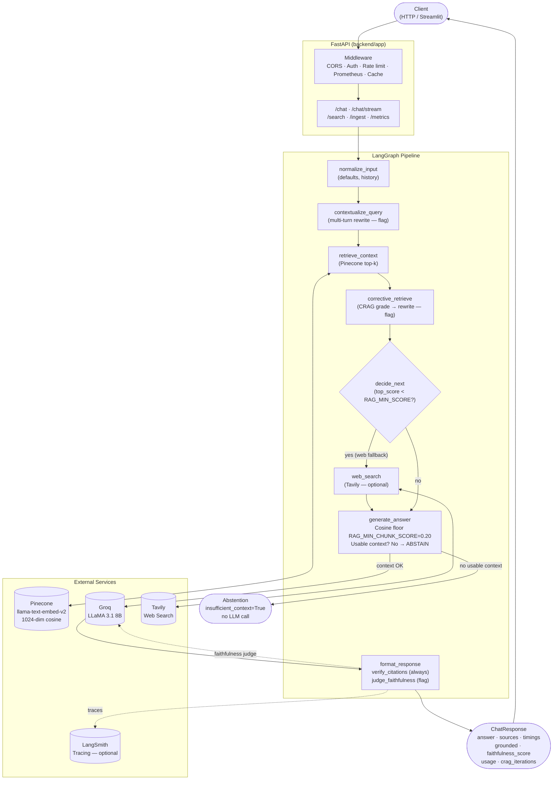

# RAG Agent Workbench — Interview Masterfile

> **Audience:** The project owner, in private.
> **Purpose:** Exhaustive preparation for ML Engineer / GenAI Engineer interviews.
> This is the single source to study to defend every decision, answer deep technical
> questions, and know the codebase cold. It is **not** the recruiter-facing shop window
> (that is `docs/DESIGN.md`). Expand freely; be honest; name every limitation.

---

## Table of Contents

- [M1 — Executive Overview](#m1--executive-overview)
- [M2 — Architecture Deep-Dive](#m2--architecture-deep-dive)
- [M3 — Every Key Decision](#m3--every-key-decision)
- [M4 — Technical Vocabulary](#m4--technical-vocabulary)
- [M5 — Code-Reading Study Guide](#m5--code-reading-study-guide)
- [M6 — Anticipated Interview Questions + Strong Answers](#m6--anticipated-interview-questions--strong-answers)
- [M7 — Deep-Dive Topics](#m7--deep-dive-topics)
- [M8 — Production & Deployment](#m8--production--deployment)
- [M9 — Known Limitations & Future Work](#m9--known-limitations--future-work)

---

## M1 — Executive Overview

### What the system is

RAG Agent Workbench is a production-style Retrieval-Augmented Generation backend built as a
deliberate engineering exercise in decision-driven design. It ingests documents from Wikipedia,
arXiv, and OpenAlex into a Pinecone vector index, then answers questions via a 7-node LangGraph
pipeline backed by Groq (LLaMA 3.1 8B) and optional Tavily web search.

Every parameter was measurement-driven. The retrieval evaluation harness was built before any
parameter was tuned. Reranking was A/B tested and disabled because the measurement showed no
improvement. The cosine floor is data-derived, not guessed. The limitations are documented
alongside the strengths — because that honesty is the interview differentiator.

### Headline capabilities

- **7-node LangGraph pipeline** with cosine-gated abstention, corrective retrieval (CRAG), and web fallback
- **Two-layer faithfulness check**: deterministic citation verification (always) + LLM-as-judge (behind flag)
- **Honest token streaming** via `llm.astream` with explicit non-streamable path handling
- **Per-request cost accounting** from actual API usage metadata, not tokenizer estimates
- **343 tests** (321 unit + 22 integration), zero network calls, zero credentials required
- **Dual deployment**: FastAPI backend on Hugging Face Spaces Docker; Streamlit frontend on Streamlit Cloud

### Stack

| Layer | Tech |
|---|---|
| API | FastAPI 0.128.0 |
| Pipeline | LangGraph / LangChain |
| Vector store | Pinecone (`llama-text-embed-v2`, 1024-dim, cosine) |
| LLM | Groq (LLaMA 3.1 8B instant) via OpenAI-compatible API |
| Web search | Tavily (optional) |
| Frontend | Streamlit |
| Observability | Prometheus (Histogram + Counter) + LangSmith (optional) |
| Container | Docker (HF Spaces, port 7860) |

### Three-length pitch

**One sentence:**
A production-style RAG backend where every design decision — reranking off, top_k=5,
cosine floor=0.20 — is backed by a retrieval evaluation harness, not intuition.

**30-second pitch:**
I built an agentic RAG system with a 7-node LangGraph pipeline: corrective retrieval,
cosine-gated abstention, two-layer faithfulness checking, and honest SSE streaming. What
makes it interesting is the engineering discipline behind each parameter: I built the
retrieval evaluation harness first (anti-circular-validation), then measured reranking
(flat-or-negative, disabled), then swept top_k (knee at k=8, chose k=5 for precision),
then derived the cosine floor from the minimum score of any known-relevant chunk (0.20,
below 0.2368). The limitations are documented alongside the strengths in DESIGN.md.

**2-minute walkthrough:**
The system answers questions over a document corpus via a 7-node pipeline: normalize_input
handles defaults and multi-turn history; contextualize_query rewrites the query using chat
history; retrieve_context fetches top-k chunks from Pinecone; corrective_retrieve (CRAG)
grades the retrieval and rewrites+re-queries if weak, up to max_iters=2; decide_next routes
to web_search (Tavily) if top_score is below the routing threshold; generate_answer filters
chunks by a cosine floor, abstains deterministically if no usable context remains, otherwise
calls Groq to generate; format_response runs deterministic citation verification and optionally
an LLM-as-judge faithfulness check.

The whole thing is backed by measurement. I built a retrieval harness (eval/ directory) before
touching any parameters — recall@k, MRR, nDCG@k, all from human-labeled golden queries where
relevant_doc_ids were set by reading documents, not by running the retriever. That anti-circular-
validation discipline is what makes the numbers trustworthy.

Reranking (bge-reranker-v2-m3) was implemented, A/B tested at both recall-oriented and
precision-oriented metrics, and disabled: nDCG@3 fell 0.057, +435ms latency, no precision
improvement anywhere. top_k was swept; the recall knee is k=8 but I chose k=5 for higher
context signal quality (P@5=0.36 vs P@8=0.24). The cosine floor=0.20 is placed below
the minimum score (0.2368) of any golden-relevant chunk from the eval set — a safety bound,
not a tuned optimum.

The system is deployed: FastAPI backend on Hugging Face Spaces, Streamlit frontend on
Streamlit Cloud. 343 tests pass in CI with zero credentials. The limitations are documented
honestly — the corpus is small and saturated, the faithfulness judge uses the same model it
judges, the prompt injection defense is mitigation not elimination.

---

## M2 — Architecture Deep-Dive

### Full request lifecycle

```
POST /chat (or /chat/stream)
      │
      ▼
FastAPI Middleware Stack
  ├─ CORSMiddleware (security.py)
  ├─ API key auth: X-API-Key header (auth.py, require_api_key dependency)
  ├─ SlowAPI rate limit: 30 req/min on /chat (rate_limit.py)
  ├─ Prometheus HTTP instrumentation (prometheus_metrics.py)
  └─ In-memory TTL cache check (cache.py, 60s TTL, 512 max, no-history-only)
      │
      ▼
run_in_threadpool → LangGraph graph.invoke()
      │
      ▼
┌─────────────────────────────────────────────────────┐
│  LangGraph Pipeline (backend/app/services/chat/graph.py)│
│                                                     │
│  1. normalize_input                                 │
│     - Set defaults (top_k, min_score, namespace)    │
│     - Normalize chat_history to (role, content) pairs│
│                                                     │
│  2. contextualize_query                             │
│     - If chat history present and CONTEXTUALIZE ON: │
│       call Groq to rewrite query in full context    │
│     - Else: pass query through unchanged            │
│                                                     │
│  3. retrieve_context                                │
│     - Pinecone search: top_k chunks (or             │
│       RAG_RERANK_CANDIDATES pool when rerank ON)    │
│     - Records top_score (max cosine) in state       │
│     - Startup log confirms model + dimension        │
│                                                     │
│  4. corrective_retrieve (CRAG)                      │
│     - If RAG_CRAG_ENABLED=False: pass-through       │
│     - If ON: grade top_score vs RAG_CRAG_GOOD_SCORE │
│       - "good" (≥0.45): break immediately           │
│       - "weak" (<0.45): rewrite query (Groq) +      │
│         re-query Pinecone; repeat ≤ max_iters=2     │
│     - Loop bound is unconditional (range())         │
│                                                     │
│  5. decide_next                                     │
│     - if top_score < RAG_MIN_SCORE (0.25)           │
│       AND use_web_fallback=True                     │
│       AND Tavily configured: → web_search           │
│     - else: → generate_answer                       │
│                                                     │
│  6. web_search (conditional)                        │
│     - Calls Tavily, appends results to state        │
│     - web_fallback_used=True in response            │
│                                                     │
│  7. generate_answer                                 │
│     - filter_chunks_by_score(retrieved,             │
│         RAG_MIN_CHUNK_SCORE=0.20) — Pinecone only   │
│     - If RAG_RERANK_ENABLED: rerank survivors       │
│     - If usable_sources empty: ABSTENTION_ANSWER,   │
│       insufficient_context=True, NO LLM call        │
│     - Else: build_rag_messages → llm.astream /      │
│       llm.invoke → Groq answer                      │
│                                                     │
│  8. format_response                                 │
│     - verify_citations: check [n] markers in answer │
│       against len(sources), zero model calls        │
│     - if RAG_FAITHFULNESS_ENABLED and not abstain:  │
│       judge_faithfulness → Groq (second LLM call)   │
│     - Populate grounded, faithfulness_score,        │
│       unverified_citations in state                 │
└─────────────────────────────────────────────────────┘
      │
      ▼
ChatResponse (Pydantic schema, backend/app/schemas/chat.py)
  answer, sources, timings, grounded, faithfulness_score,
  unverified_citations, insufficient_context, crag_iterations,
  corrective_action, contextualized_query, usage (by_call_type),
  web_fallback_used, top_score, cached, trace metadata

      │
      ▼
Prometheus counters updated, timing histogram recorded
```

### For /chat/stream specifically

- Pre-generation nodes (normalize → corrective_retrieve) run sync in thread pool
- `generate_answer` uses `llm.astream` for real TTFT improvement
- `format_response` runs sync after generation completes
- SSE protocol: `event: token\ndata: {"text": "..."}\n\n` per token
- `event: done\ndata: {full JSON payload}\n\n` at end
- Cache hits and abstentions: one `event: token` with full text, `done.cached=True`

### ChatState object (graph.py)

Key fields that flow through the graph:
```python
class ChatState(TypedDict):
    query: str
    contextualized_query: Optional[str]
    namespace: str
    top_k: int
    min_score: float
    use_web_fallback: bool
    chat_history: List[Dict[str, str]]
    retrieved: List[Dict]           # Pinecone chunks
    top_score: float                # used by decide_next and CRAG
    web_results: List[Dict]         # Tavily results
    web_fallback_used: bool
    answer: str
    sources: List[Dict]
    timings: Dict[str, float]
    insufficient_context: bool
    crag_iterations: int
    corrective_action: Optional[str]
    grounded: Optional[bool]
    faithfulness_score: Optional[float]
    unverified_citations: List[str]
    usage: Optional[Dict]
```

### Architecture diagram (Mermaid)



---

## M3 — Every Key Decision

### Decision 1: Eval-first, anti-circular-validation

**WHY:** Building the eval harness before any parameter is tuned ensures every subsequent
decision has a trustworthy measurement behind it. If you tune first and measure later, you
risk optimizing on intuition and then confirming with a number that was never designed to
measure what you tuned.

**HOW:** `eval/` was built before Tier 2 features. `eval/golden.jsonl` contains 30 queries
with `relevant_doc_ids` determined by reading the source documents — NOT by running the
retriever and copying its output.

**TRADEOFF:** Building the harness first adds upfront cost with no immediate feature output.
The payoff is that every subsequent A/B test (reranking, top_k, cosine floor) produces
numbers you can defend.

**ALTERNATIVE CONSIDERED:** Skipping formal eval and using intuition / anecdotal testing.
This is the norm for side projects but produces unjustifiable decisions.

**LIMITATION:** The corpus is 34 chunks / 23 documents — small enough that baseline dense
retrieval is already saturated at recall@10=0.97. At this scale, every metric is
ceiling-bound; apparent improvements may be noise. The harness is structurally correct but
the corpus needs to be at least 10× larger to produce statistically meaningful results.

**THE CIRCULAR VALIDATION ANTI-PATTERN (critical concept):** If you run the retriever,
copy the top-k results as your "relevant" set, then measure recall@k — you will always
get recall=1.0 by construction. The retriever will appear perfect because the labels were
derived from its output. Every labeling decision in `golden.jsonl` was made by a human
reading the source documents independently.

---

### Decision 2: Two-threshold retrieval gate

**WHY:** Two separate thresholds serve two fundamentally different purposes and must be
independently configurable. Conflating them would create a single threshold that silently
serves both purposes, making tuning harder and failures harder to diagnose.

**HOW:**

| Setting | Default | Purpose | File |
|---|---|---|---|
| `RAG_MIN_SCORE` | 0.25 | **Routing**: if top_score < 0.25, route to web fallback | `config.py` |
| `RAG_MIN_CHUNK_SCORE` | **0.20** | **Safety floor**: drop individual chunks below this before LLM context | `config.py` |

`RAG_MIN_SCORE` reads `top_score` (the max cosine across ALL retrieved chunks) to decide
on routing. `RAG_MIN_CHUNK_SCORE` filters individual chunks before they enter the prompt.
`decide_next` reads top_score from the unfiltered list; `generate_answer` then applies the
chunk floor to the same list.

**TRADEOFF:** Two thresholds with different semantics create more configuration surface.
The upside is that routing and quality-filtering can be tuned independently.

**THE 0.20 SAFETY BOUND:** The chunk floor at 0.20 is data-derived: the minimum cosine
score of any golden-relevant chunk across 30 eval queries (at top-20 fetch) was 0.2368.
Setting the floor at 0.20 places it below this bound so no known-relevant chunk from the
eval set is excluded. It is NOT a tuned optimum — sharp calibration requires chunk-level
graded relevance labels, which don't exist.

Note: the prior floor was 0.25, which was above 0.2368 — meaning one known-relevant chunk
could have been dropped. This was corrected in the T2.2 calibration step.

---

### Decision 3: Reranking — evaluated and disabled

**WHY THIS MATTERS:** This is the single most defensible engineering decision in the project
because it shows actual measurement over assumed benefit. The honest answer to "did reranking
help?" is "No, and I have the numbers."

**HOW:** Implemented `backend/app/services/rerank.py` using `pc.inference.rerank` with
`bge-reranker-v2-m3`. Added `RAG_RERANK_ENABLED` flag (default False). Added `eval/run_ab.py`
for A/B evaluation (`make eval-ab`, `make eval-ab-topk`). Ran two evaluation passes.

**WHAT THE NUMBERS SHOWED:**

Initial A/B (recall-oriented metrics, `eval/reports/ab_20260625T083719Z.*`):

| Metric | Baseline | Rerank | Δ |
|---|---|---|---|
| nDCG@3 | 0.8750 | 0.8176 | **−0.057** |
| nDCG@5 | 0.8997 | 0.8687 | **−0.031** |
| Precision@1 | 0.9655 | 0.9655 | **0.000** (tie) |
| MRR | 0.9828 | 0.9828 | **0.000** (tie) |
| Mean latency | 359.6 ms | 795.2 ms | **+435 ms** |

**OBJECTION HANDLING — "but recall@10 is the wrong metric for reranking":**
Reranking is supposed to improve top-of-list precision (nDCG@3, nDCG@5, P@1), not recall.
The initial run showed recall@10 falling; a follow-up run (`make eval-ab-topk`) explicitly
tested the top-heavy precision metrics reranking is designed to optimize:
- nDCG@3: −0.057 (baseline wins)
- nDCG@5: −0.031 (baseline wins)
- Precision@1: 0.000 tie
- No metric favored reranking.

**ROOT CAUSE:** `candidates=20` with `RAG_MIN_CHUNK_SCORE=0.25` causes the cosine floor
to silently drop borderline-relevant chunks before the reranker sees them. The reranker
cannot improve ordering for documents it never receives. Two levers to revisit: raise
`RAG_RERANK_CANDIDATES` to 40-50, or lower `RAG_MIN_CHUNK_SCORE` specifically for the
rerank input pool.

**ALTERNATIVE CONSIDERED:** Set `RAG_RERANK_ENABLED=True` as default. Rejected: the
measurement showed no benefit, +435ms latency tax, and an active downside (nDCG falls).

**LIMITATION:** The corpus is small and well-separated — 34 chunks / 23 docs at 0.97
recall@10. The reranker cannot demonstrate headroom that doesn't exist. The correct verdict
is "enable after the corpus grows to where dense retrieval misfires on precision," not
"reranking doesn't work."

---

### Decision 4: top_k = 5 (precision-first)

**WHY:** Context quality matters more than context coverage when the LLM processes the
prompt. Larger k increases recall but decreases precision — meaning more irrelevant chunks
enter the LLM context window ("lost in the middle" effect increases, signal/noise ratio
falls).

**HOW:** `eval/run_sweep.py` (`make eval-sweep`) fetched 20 chunks per query, then sliced
to compute metrics at doc-level k = 1, 2, 3, 5, 8, 10 — one Pinecone call per query, not
one per k value.

**THE QUALITY-VS-K CURVE (n=30 queries):**

| k | Recall@k | nDCG@k | P@k | Δ-Recall | Δ-nDCG |
|---|---|---|---|---|---|
| 1 | 0.581 | 0.967 | 0.967 | −0.400 | +0.034 |
| 2 | 0.739 | 0.864 | 0.683 | −0.242 | −0.069 |
| 3 | 0.858 | 0.879 | 0.556 | −0.122 | −0.053 |
| 5 | 0.914 | 0.903 | **0.360** | −0.067 | −0.030 |
| 8 | **0.969** | **0.928** | 0.242 | −0.011 | −0.005 |
| 10 | 0.981 | 0.933 | 0.197 | 0.000 | 0.000 (sweep ceiling) |

> **Note on the two runs:** the k-sweep (n=30 queries, `make eval-sweep`) measured
> recall@10=0.981. The A/B experiment (n=29 queries, `make eval-ab`) measured
> recall@10≈0.97 (0.9684) as the baseline. Both are real; the small difference is
> explained by the different query sets (30 vs 29). **The headline figure throughout
> this project is ≈0.97 (A/B baseline),** which is the number cited in DESIGN.md,
> the reranking decision, and every external-facing artifact.

**RECALL KNEE:** k=8. Both recall@8=0.969 (Δ=0.011 below ceiling) and nDCG@8=0.928
(Δ=0.005 below ceiling) are within the ±0.02 margin simultaneously. k=5 does NOT qualify:
recall@5 delta=0.067, nDCG@5 delta=0.030 — nDCG exceeds margin.

**DECISION: kept at 5 despite the knee being at 8.** Reasoning: P@5=0.36 vs P@8=0.24
means k=5 delivers 49% higher-precision context. Moving from k=5 to k=8 costs 60% more
LLM-context chunks for 6.7 recall points and 3 nDCG points.

**WHY recall@k can't settle this:** recall@k measures whether relevant doc_ids appear in
the top-k list. It does NOT measure whether a larger, noisier context improves LLM answer
quality. The tiebreaker is an answer-quality eval (head-to-head human judgments at k=5 vs
k=8). That eval does not yet exist. Until it does, precision is preferred.

**ALTERNATIVE CONSIDERED:** k=8 (recall-margin knee). Would recover 6.7 recall points
but dilute context quality — and without an answer-quality eval, there's no evidence the
LLM answer improves.

---

### Decision 5: Bounded CRAG corrective loop

**WHY:** Without a hard loop bound, a query on a topic not in the knowledge base will spin
indefinitely (always grades weak → always rewrites → always re-queries → always grades
weak). This exhausts Groq API rate limits and blocks the user forever.

**HOW:** `corrective_retrieve` in `graph.py` uses `for iteration in range(max_iters)` with
`break` on a "good" grade. `RAG_CRAG_MAX_ITERS=2` is the default. The bound is
unconditional — the loop ALWAYS terminates after max_iters regardless of outcome.

**GRADING:** uses `state["top_score"]` already in state — the max cosine score returned
by `retrieve_context`. No re-embedding. `RAG_CRAG_GOOD_SCORE=0.45` is the "good" threshold
(PLACEHOLDER, not tuned).

**FLAG DEFAULT OFF (`RAG_CRAG_ENABLED=False`):** On a saturated corpus (recall@10=0.97),
CRAG will rarely fire — initial retrieval almost always returns strong results. The latency
tax (extra LLM call + Pinecone query per iteration) is unjustified when the corrective
loop almost never triggers on in-corpus queries. Enable after observing real out-of-corpus
failures where the rewrite demonstrably helps.

**CIRCULAR-VALIDATION AVOIDANCE:** The grader does not re-embed the query. It reads the
cosine score already computed by the retriever. Re-embedding would assess the retriever's
output with the retriever's own semantic space — the same anti-pattern as the eval labeling
discipline and the faithfulness judge design.

**LIMITATION:** `RAG_CRAG_GOOD_SCORE=0.45` is an unvalidated placeholder. Tuning it
requires labeled out-of-corpus queries where human judges evaluate whether the corrective
rewrite actually improved the answer.

---

### Decision 6: Two-layer faithfulness check

**WHY:** A single LLM-judge step would be expensive (every request pays for two LLM calls)
and imprecise for a common class of errors (citation markers referencing non-existent chunk
indices — a purely structural check). The two-layer design separates the free deterministic
check from the expensive model-based check.

**HOW:**

| Layer | File | When | Cost | What |
|---|---|---|---|---|
| `verify_citations` | `faithfulness.py` | Always | Zero (regex, no model) | `[n]` markers that reference out-of-range indices |
| `judge_faithfulness` | `faithfulness.py` | Flag ON + not abstaining | 1 Groq call | Whether claims are supported by retrieved text |

**CIRCULAR-VALIDATION AVOIDANCE (critical):** The judge uses the existing Groq LLM — NOT
the retrieval embedder. If we re-embedded the answer with `llama-text-embed-v2` and
compared cosine similarity to retrieved chunks, we would be validating the retriever's
output using the retriever's own semantic representation. The judge (`faithfulness_prompt.py`)
gives Groq the retrieved context and the answer and asks: "are the answer's claims
supported by this context?" That is a natural-language reasoning task, not an embedding
similarity task.

**FLAG DEFAULT OFF (`RAG_FAITHFULNESS_ENABLED=False`):** Every request would otherwise
pay for a second LLM call. On Groq's free tier the cost is latency (faithfulness_ms ≈
several hundred ms), not money, but still undesirable for interactive chat.

When flag is OFF:
- `verify_citations` still runs (free)
- `grounded` and `faithfulness_score` are `null` in `ChatResponse`
- Frontend shows no per-answer grounding badge

**FLAG-AND-REPORT, NOT HARD-FAIL:** When the judge detects an ungrounded answer, the
response is flagged (`grounded=False`) and returned to the caller — the answer is not
suppressed. Rationale: the judge can itself be wrong. A false "ungrounded" verdict would
silently corrupt a correct answer. Callers who want to suppress ungrounded answers inspect
`ChatResponse.grounded`.

**`RAG_FAITHFULNESS_THRESHOLD=0.5` IS A PLACEHOLDER.** Not evidence-backed. Calibrate
by collecting answer/context pairs, human-labeling each as grounded/ungrounded, scoring
with the judge, and finding the F1-maximizing threshold.

**LIMITATION:** same-model self-preference bias. The Groq LLM judges its own output. A
model grading its own claims has a documented tendency toward self-consistency — it may
rate its claims as grounded even when they are not. A second independent model (different
provider) would give a less biased verdict at higher cost and latency.

---

### Decision 7: Honest token streaming

**WHY:** The previous `/chat/stream` implementation split the completed answer string on
whitespace and yielded tokens one by one — simulating streaming from a completed string.
This misrepresented itself as streaming and provided no TTFT improvement.

**HOW:** `/chat/stream` uses `llm.astream` for the generation node only. Pre-generation
nodes (retrieval, CRAG, web search) run sync in a thread pool — async-native equivalents
would add complexity without meaningful latency improvement for I/O-bound operations.

**NON-STREAMABLE PATHS ARE HANDLED HONESTLY:**
- Cache hit → one `event: token` with the full cached answer, `done.cached=True`
- Abstention → one `event: token` with the deterministic abstention text
- Neither path calls the LLM or simulates word-by-word output

**SSE PROTOCOL:** `event: token\ndata: {"text": "..."}\n\n` per token fragment;
`event: done\ndata: {full JSON payload}\n\n` at end; `event: error\ndata: {"message": ...}\n\n`
on failure.

**LIMITATION:** Pre-generation nodes (retrieval, CRAG, web search) are not streamed — the
client waits for them before any tokens appear. TTFT improvement is limited to the
generation phase.

---

### Decision 8: Cost and token observability

**WHY:** Token counts from a local tokenizer are estimates. The actual counts come from the
API response's `usage_metadata`, which accounts for the model's actual tokenization and any
framework-level overhead (system prompt, history formatting, etc.).

**HOW:** `backend/app/core/cost_accounting.py` reads `response.usage_metadata` after each
Groq call. All four LLM call types are tracked separately in `ChatResponse.usage.by_call_type`:
- `generation` — main RAG answer
- `faithfulness_judge` — faithfulness check (when enabled)
- `crag_rewrite` — CRAG query rewrite (when enabled)
- `contextualization` — multi-turn query rewrite (when enabled)

Emitted as `llm_tokens_total{call_type=...}` Prometheus Counter.

**LIMITATION:** Dollar cost (`estimated_cost_usd`) is computed from a static pricing table
pinned to `2026-06-25`. It does not account for free-tier credits, batch pricing, or
promotional rates. Treat as order-of-magnitude indicator, not billing source of truth.
Embedding token counts are not reported — the Pinecone SDK does not expose them.

---

### Decision 9: Reproducible corpus + pinned dimension

**WHY:** Without a committed corpus manifest, there's no way to know if the live Pinecone
index has drifted from what the eval results were computed against. The eval numbers become
untrustworthy if the corpus changes silently.

**HOW:** `eval/corpus_manifest.py generate` snapshots vector IDs from the live index to
`eval/corpus_manifest.json`. `corpus_manifest.py validate` compares committed manifest vs
live index and reports drift without auto-reconciling. Both operations are read-only.

`PINECONE_EMBED_MODEL` and `PINECONE_EMBED_DIMENSION` are now explicit in `Settings` and
logged at startup: `Pinecone embedding config model='llama-text-embed-v2' dimension=1024`.
This removes the implicit dependency on Pinecone's default dimension.

**LIMITATION (chunk size below recommended):** `RecursiveCharacterTextSplitter` is
configured to 900 chars ≈ 225 tokens per chunk. Pinecone's guidance for `llama-text-embed-v2`
suggests 400–500 tokens for best retrieval quality. Current chunks are roughly half the
recommended minimum. Changing `chunk_size` requires re-ingestion and re-evaluation.

---

### Decision 10: Dependency locking discipline

**WHY:** LangChain/LangGraph ships breaking API changes on minor version bumps (e.g.,
`langchain-core` 0.x → 1.x removed and renamed public classes; Pinecone SDK 3.x → 7.x
changed the integrated-embedding API). Unpinned installs silently pull these changes.
Docker builds must be reproducible — two `docker build` calls hours apart should produce
identical images.

**HOW:** `.in` files (human-edited intent) + `.txt` files (machine-generated lock from
`uv pip compile`). Backend lock: `backend/requirements.txt`, compiled with
`--python-version 3.11 --python-version 3.11` to match `FROM python:3.11-slim`. Backend
uses `--generate-hashes` for supply-chain integrity. Frontend compiled for Linux Python
3.13 (matches Streamlit Cloud's runtime).

**THE CONDA-VS-PIP LESSON:** Development environment was a shared conda env. Conda and pip
use different dependency solvers — conda can co-install packages that pip considers
incompatible (e.g., `langsmith==0.4.38` alongside `langchain-core==1.1.0` which requires
`langsmith>=0.9.0`). The pinned `.txt` files reflect what pip/uv would install in a clean
pip environment, NOT what conda shows in `pip freeze`. Always validate the lock in a clean
pip venv. The CI job on `ubuntu-latest` with Python 3.11 is the authoritative clean-install
validation, not `pip freeze` from the conda env.

---

### Decision 11: Prometheus Histograms over deque p95

**WHY:** The legacy `_timing_samples: deque(maxlen=20)` computes p95 over only the last
20 samples. With 20 observations, floor(0.95 × 20) = 19th sample — confidence interval on
p95 is approximately ±30%. This is statistically unreliable.

**HOW:** `backend/app/core/prometheus_metrics.py` uses `prometheus_client.Histogram` with
standard HTTP duration buckets. The Histogram accumulates ALL observations (unbounded
sample count) and computes percentiles from the cumulative bucket distribution. Percentiles
converge as more requests are processed.

The deque remains in `/metrics` for backward compatibility but is documented as legacy.
`/metrics/prometheus` (Prometheus text exposition, public) is the authoritative source.

**WHY `prometheus-client` DIRECTLY (not prometheus-fastapi-instrumentator):**
`prometheus-fastapi-instrumentator==8.0.2` requires `starlette>=1.0.0`, incompatible with
`starlette==0.50.0` pinned by `fastapi==0.128.0`. Upgrading starlette broke FastAPI
internals. `prometheus-client` has zero framework dependency and provides all needed primitives.

---

## M4 — Technical Vocabulary

### RAG (Retrieval-Augmented Generation)

**Definition:** A pattern where a language model's response is grounded in relevant
documents retrieved at query time, rather than relying solely on parametric knowledge.
The retrieval step fetches relevant chunks; the LLM uses those chunks as context to
generate a grounded answer.

**In this project:** FastAPI + LangGraph pipeline retrieves from Pinecone, passes chunks
to Groq LLM with a structured prompt instructing citation.

---

### Dense vs hybrid retrieval

**Dense retrieval:** Encodes both the query and documents into dense vector embeddings
(continuous, high-dimensional). Similarity measured by cosine distance between vectors.
Captures semantic similarity — e.g., "fast car" and "rapid automobile" are close in
embedding space.

**Hybrid retrieval:** Combines dense embedding search with sparse (BM25/TF-IDF) keyword
search. Dense handles semantics; sparse handles keywords/proper nouns. Merged via
reciprocal rank fusion or score combination.

**In this project:** Dense only (`llama-text-embed-v2`, 1024-dim cosine). Hybrid search
was designed and documented but not implemented — the recall gap it addresses
(proper-noun queries where BM25 would help) does not exist at current corpus size
(recall@10=0.97).

---

### Reranking / cross-encoder

**Definition:** A second-stage model that takes the (query, document) pair as joint input
and produces a fine-grained relevance score. Unlike bi-encoders (dense retrieval), which
encode query and document independently, cross-encoders attend over both simultaneously —
capturing interactions dense retrieval misses.

**Trade-off:** Cross-encoders are much slower (quadratic attention over query+doc) than
bi-encoders. Used only on a small candidate set (top-20 or top-50) after dense retrieval.

**In this project:** `bge-reranker-v2-m3` via Pinecone hosted inference. Implemented,
A/B tested, disabled. nDCG@3 fell 0.057, +435ms latency. `RAG_RERANK_ENABLED=False`.

---

### Retrieval metrics (with formulas)

**Recall@k:**
```
recall@k = |retrieved_top_k ∩ relevant| / |relevant|
```
Measures what fraction of relevant documents appear in the top-k results.
Pure coverage metric — ignores ordering. Saturates easily on small corpora.
This project: **headline ≈0.97** (A/B baseline, n=29); k-sweep measured 0.981 at k=10
(n=30, different run — see Decision 4 note). recall@8=0.969, recall@5=0.914.

**MRR (Mean Reciprocal Rank):**
```
MRR = mean over queries of (1 / rank_of_first_relevant_result)
```
Measures how high the FIRST relevant result ranks. Only cares about position of
the first relevant hit. This project: MRR=0.983 at k=10.

**nDCG@k (Normalized Discounted Cumulative Gain):**
```
DCG@k = Σ(i=1 to k) rel_i / log2(i+1)
IDCG@k = DCG of ideal (perfect) ranking
nDCG@k = DCG@k / IDCG@k
```
Rewards relevant results ranked higher (logarithmic discount). With binary relevance,
nDCG@k = 1.0 only when all relevant docs appear in positions 1...|relevant|.
This project: nDCG@10=0.933 at baseline (dense-only).

**Precision@k:**
```
P@k = |retrieved_top_k ∩ relevant| / k
```
Measures what fraction of the top-k results are relevant. Trades off against recall.
This project: P@5=0.360, P@8=0.242 — key driver of the top_k=5 decision.

**Why metric family matters:** Reranking is designed to improve top-of-list precision
(nDCG@3, P@1), not recall@10. Using recall@10 to evaluate reranking gives the reranker
no upside — it can only lose recall on a saturated corpus. The second A/B run used
nDCG@3, nDCG@5, P@1 — the right family. Reranking was still flat-or-negative.

---

### Cosine similarity

**Definition:**
```
cosine_sim(A, B) = (A · B) / (|A| × |B|)
```
Measures the angle between two vectors. 1.0 = identical direction, 0.0 = orthogonal,
−1.0 = opposite. Embedding vectors are typically L2-normalized so cosine = dot product.

**In this project:** Pinecone uses cosine metric. Scores range [0, 1] for normalized
embeddings. The cosine floor `RAG_MIN_CHUNK_SCORE=0.20` and routing threshold
`RAG_MIN_SCORE=0.25` are calibrated for cosine scores. Reranker scores use a completely
different numerical distribution — they must NEVER be threshold-compared against cosine
calibrations.

---

### Chunking and overlap

**Definition:** Documents are split into fixed-size segments (chunks) before embedding.
Overlap allows adjacent chunks to share context, preventing information at chunk boundaries
from being lost.

**In this project:** `RecursiveCharacterTextSplitter`, `chunk_size=900` chars (~225 tokens),
`chunk_overlap=100` chars. Pinecone record IDs: `{doc_id}:{chunk_idx}`.

**Issue:** Pinecone's guidance for `llama-text-embed-v2` suggests 400–500 tokens for best
retrieval quality. Current ~225 tokens is roughly half the recommended minimum. Changing
requires re-ingestion + re-evaluation.

**Safety cap:** `MAX_CHARS_PER_CHUNK=6000` in `chunking.py:21` — purely defensive, never
activates under normal splitter operation (900 < 6000).

---

### Embedding dimensionality

**Definition:** The length of the embedding vector. Higher dimensions capture more
information but cost more storage and compute. `llama-text-embed-v2` supports 384 to 2048
dimensions; default is 1024.

**In this project:** 1024-dim, cosine metric. Pinecone index was created with 1024-dim
at setup time. The dimension is now explicit in `Settings` (`PINECONE_EMBED_DIMENSION=1024`)
and logged at startup to prevent silent dimension mismatches.

---

### CRAG (Corrective RAG)

**Definition:** A self-correcting retrieval loop that grades the quality of initial
retrieval and, if weak, rewrites the query and re-retrieves. Adds a quality gate between
retrieval and generation.

**In this project:** `corrective_retrieve` node in `graph.py`. Grades using cosine
`top_score` already in state (no re-embedding). Rewrites using Groq. Hard loop bound
`max_iters=2` via `range()`. Disabled by default on saturated corpus.

---

### Faithfulness / Groundedness

**Definition:** Whether an LLM's answer is supported by ("grounded in") the provided
context. An ungrounded answer makes claims not present in the retrieved documents —
hallucinated content.

**In this project:** Two-layer check:
1. `verify_citations` — structural (zero model calls): checks `[n]` markers reference valid chunk indices
2. `judge_faithfulness` — semantic (one Groq call): asks LLM whether answer claims are supported by context

`grounded=True` means all checks passed. `grounded=False` means claims appear unsupported.
`grounded=None` means the flag was off (not checked). `ChatResponse.insufficient_context=True`
means no LLM call was made (abstention) — faithfulness check never runs on abstentions.

---

### Circular validation

**Definition:** Using a system's own output or internal representation to validate that
same system's output. Creates a closed loop where the system always validates itself
correctly regardless of actual quality.

**In this project — THREE instances prevented:**
1. Eval labels: `relevant_doc_ids` in `golden.jsonl` were set by reading documents, not by running the retriever
2. CRAG grader: uses cosine score from state, NOT re-embedding with the retrieval model
3. Faithfulness judge: uses Groq LLM, NOT cosine similarity via the retrieval embedder

---

### LLM-as-judge

**Definition:** Using a language model to evaluate the quality of another model's output.
Common for tasks where rule-based metrics are insufficient (faithfulness, coherence,
answer quality).

**Limitation:** Same-model self-preference bias. A model grading its own output tends to
rate it highly even when the claims are wrong. An independent model gives less biased
verdicts.

**In this project:** `judge_faithfulness` in `faithfulness.py` calls Groq with the
retrieved context and the generated answer. `faithfulness_prompt.py` defines the judge
prompt (strict: cite specific contradictions, don't give benefit of the doubt).

---

### Indirect prompt injection

**Definition:** An attacker embeds instructions in a document that gets retrieved and
included in the LLM's context. The LLM "follows" the embedded instructions, overriding
the system prompt.

**In this project:** The RAG system prompt instructs the LLM to use only the supplied
context and cite inline. Context snippets are labeled `[1]`, `[2]`, etc. This structural
delimiting reduces injection risk but does not eliminate it. A sufficiently adversarial
document can still attempt to override instructions via chunk text.

---

### SSE (Server-Sent Events)

**Definition:** A one-directional HTTP streaming protocol. Server sends `event:` + `data:`
frames; client receives them as they arrive without polling.

**In this project:** `/chat/stream` SSE protocol:
```
event: token
data: {"text": "...token fragment..."}

event: done
data: {full ChatResponse JSON}

event: error
data: {"message": "..."}
```
The Streamlit frontend `iter_chat_stream()` parses this protocol in `frontend/app.py`.

---

### Histogram quantiles (Prometheus)

**Definition:** A Histogram tracks observations in predefined buckets (`le=0.05`,
`le=0.1`, etc.). Quantiles (p50, p95, p99) are computed from the cumulative bucket
distribution — not from a stored sample list.

**Why better than a sample deque:** A deque with maxlen=20 gives p95 from 20 samples
(±30% CI). A Histogram accumulates ALL observations; CI narrows as sample count grows.
For p95 to be meaningful you need at least ~100 observations — a deque with maxlen=20
never reaches that.

**In this project:** `backend/app/core/prometheus_metrics.py`. HTTP request duration and
RAG phase duration as Histograms. The 20-sample deque remains in `/metrics` as legacy.

---

### Lockfiles and hash pinning

**Definition:** A lockfile pins every transitive dependency to an exact version. Hash
pinning adds cryptographic hashes of each wheel/sdist, verifying integrity against
supply-chain attacks (compromised mirrors, typosquatting).

**In this project:** `backend/requirements.txt` (compiled with `--generate-hashes`),
`requirements.txt` (frontend, pinned without hashes for cross-platform compatibility).
The backend lock is compiled with `--python-version 3.11` to match the Dockerfile.
The frontend lock is compiled with `--python-platform linux --python-version 3.13` to
match Streamlit Cloud's runtime (Python 3.13.14, Linux x86_64).

---

## M5 — Code-Reading Study Guide

A sequenced path for understanding the codebase efficiently. Each stop names WHAT to
understand and WHY it matters.

---

### Stop 1: `backend/app/services/chat/graph.py`

**Start here.** This file is the heart of the system.

**What to understand:**
- `ChatState` TypedDict — the complete state object flowing through the graph
- Every node function (`normalize_input`, `contextualize_query`, `retrieve_context`,
  `corrective_retrieve`, `decide_next`, `web_search`, `generate_answer`, `format_response`)
- How the graph is constructed (`StateGraph`, `add_node`, `add_edge`, `add_conditional_edges`)
- The `ABSTENTION_ANSWER` constant and the `if not usable_sources` guard in `generate_answer`
- How `crag_iterations` is tracked and returned
- Where `llm.astream` vs `llm.invoke` is chosen

**Why it matters:** Every architectural decision manifests here. Understanding the node
sequence and state flow is prerequisite to understanding everything else.

---

### Stop 2: `backend/app/core/config.py`

**The control panel.** Every tunable parameter lives here.

**What to understand:**
- `Settings` class with `pydantic-settings.BaseSettings`
- Three required fields (`Field(...)` with no default): `PINECONE_API_KEY`,
  `PINECONE_INDEX_NAME`, `PINECONE_HOST` — these must be set or `Settings()` raises
  `ValidationError` (critical for CI fix understanding)
- The two retrieval thresholds: `RAG_MIN_SCORE=0.25` (routing) vs `RAG_MIN_CHUNK_SCORE=0.20` (floor)
- The flag cluster: `RAG_CRAG_ENABLED`, `RAG_FAITHFULNESS_ENABLED`, `RAG_RERANK_ENABLED`
- Placeholder thresholds: `RAG_CRAG_GOOD_SCORE=0.45`, `RAG_FAITHFULNESS_THRESHOLD=0.5`
- `get_settings()` is an `@lru_cache` singleton — cache must be cleared in tests

**Why it matters:** Understanding which knobs exist, their defaults, and which are
validated vs optional is essential for deployment and testing discussions.

---

### Stop 3: `backend/app/services/pinecone_store.py`

**Retrieval implementation.**

**What to understand:**
- `init_pinecone()` — startup initialization, startup log (model + dimension)
- `pinecone_search()` — the actual retrieval call
- `field_map={"text": settings.PINECONE_TEXT_FIELD}` — critical: the text field name
  MUST match what was used when the index was created. Default is `"chunk_text"` but
  the live index uses `"content"`. Mismatch = silent empty context (see M8).
- `PINECONE_TEXT_FIELD` env var in HF Secrets set to `"content"`.

**Why it matters:** The field_map mismatch was the most insidious production bug. It
produced no error — just silent empty context on every query. Understanding why is a
great interview story.

---

### Stop 4: `backend/app/services/faithfulness.py`

**The two-layer faithfulness implementation.**

**What to understand:**
- `verify_citations(answer, sources)` — pure regex, zero model calls, always runs
- `judge_faithfulness(query, answer, context, llm)` — the LLM-as-judge call
- `FaithfulnessVerdict` dataclass — `grounded: Optional[bool]`, `score: Optional[float]`
- Why Groq (not embedder) is used for the judge
- The "flag and report, not hard fail" design — why `grounded=False` doesn't suppress the answer

**Why it matters:** Faithfulness is the most subtly designed component. The circular
validation avoidance and the flag-and-report design are both defensible with specific rationale.

---

### Stop 5: `eval/metrics.py`

**Pure metric functions — the math foundation.**

**What to understand:**
- `recall_at_k`, `mrr`, `ndcg_at_k` — pure functions, no model imports, stdlib only
- The formula for each (you need to be able to write these from memory)
- How document-level deduplication works in `eval/run.py` (`doc_id` from `fields` or
  `_id.rsplit(":", 1)[0]`)
- Why these functions are standalone and independently testable

**Why it matters:** Being able to explain and derive the metric formulas on a whiteboard
is table stakes for an ML engineer interview.

---

### Stop 6: `backend/app/schemas/chat.py`

**The contract between backend and frontend.**

**What to understand:**
- `ChatResponse` — the complete schema: `answer`, `sources`, `timings`, `grounded`,
  `faithfulness_score`, `unverified_citations`, `insufficient_context`, `crag_iterations`,
  `usage.by_call_type`, `cached`, `web_fallback_used`, `top_score`
- `SourceHit` — per-source metadata with cosine `score`, `chunk_text`, `title`, `url`
- `ChatTimings` — retrieve_ms, web_ms, generate_ms, faithfulness_ms, rerank_ms
- `TokenUsage` and `ByCallType` — token accountability structure

**Why it matters:** The schema is the observability surface. Every interview question about
"how do you know if the system is working?" has an answer in this schema.

---

### Stop 7: `eval/run_ab.py` + `eval/reports/ab_20260625T083719Z.{json,md}`

**The reranking A/B experiment.**

**What to understand:**
- How the A/B harness works (baseline vs rerank arm, same queries, metric delta table)
- Read the actual report: nDCG@3 baseline=0.875 vs rerank=0.818 (Δ=−0.057)
- The follow-up `make eval-ab-topk` run that tested precision-oriented metrics
- Why candidates=20 with MIN_CHUNK_SCORE=0.25 limits what the reranker can see
- The conclusion: `RAG_RERANK_ENABLED=False` is empirically validated

**Why it matters:** This is the decision with the most interview depth. "You measured
the reranker was worse?" is a predictable attack — you need the top-heavy validation
rationale ready.

---

### Stop 8: `tests/integration/conftest.py`

**How CI-safe integration tests work.**

**What to understand:**
- Why `os.environ.setdefault()` is used (not `os.environ[key] = value`) — preserves real
  credentials in local dev, sets dummies only when absent (CI)
- The ordering: env vars BEFORE `from app.main import app` (because `get_settings()` is
  called at module level via `@lru_cache`)
- The cache-clearing pattern (`get_settings.cache_clear()`, `_get_configured_api_key.cache_clear()`)
- `_graph_mod._graph = None` — resetting the singleton compiled graph
- `patch("app.main.init_pinecone")` — prevents Pinecone SDK call at startup

**Why it matters:** The Settings-in-CI bug was subtle and required understanding pydantic-settings
validation at import time. Being able to explain this demonstrates deep understanding of
dependency injection and LRU cache behavior in testing contexts.

---

### Stop 9: `backend/app/core/prometheus_metrics.py`

**Observability implementation.**

**What to understand:**
- `http_requests_total` Counter labeled by method, path, status_code
- `http_request_duration_seconds` Histogram — the authoritative latency source
- `rag_phase_duration_seconds` Histogram labeled by phase (retrieve, generate, faithfulness)
- `llm_tokens_total` Counter labeled by call_type
- Why `prometheus-client` directly (not `prometheus-fastapi-instrumentator`) — starlette version conflict
- Why `/metrics/prometheus` is public (Prometheus pull model, no secrets exposed)

**Why it matters:** Observability is a standard interview topic for production systems.

---

### Stop 10: `frontend/app.py`

**The Streamlit chatbot UI.**

**What to understand:**
- `iter_chat_stream()` — the SSE parser, handling `event: token/done/error/end`
- `_render_quality_indicator()` — the five distinct states (abstention, grounded,
  grounded+unverified, ungrounded, not-evaluated)
- `_render_retrieval_debug()` — exposes cosine scores, CRAG iteration counts, timing metrics
- `render_sidebar()` — faithfulness mode indicator derived from last response
- Why `st.session_state` stores full response metadata (not just answer text) — to replay
  quality badges on chat history without re-calling the backend

**Why it matters:** The frontend design decisions (honest display, no fabrication,
explicit non-streamable cases) mirror the backend design philosophy.

---

## M6 — Anticipated Interview Questions + Strong Answers

Organized by theme. Format: **Q:** → **A:** (the strong answer). Attack questions marked **[ATTACK]**.

---

### RETRIEVAL

**Q: Walk me through your retrieval pipeline.**

**A:** The LangGraph pipeline starts with `normalize_input` to set defaults and clean
chat history, then `contextualize_query` to rewrite multi-turn queries with full
conversation context. `retrieve_context` fetches top-k chunks from Pinecone using
`llama-text-embed-v2` integrated embeddings (1024-dim cosine). `corrective_retrieve`
(CRAG, disabled by default) grades the retrieval by cosine score and optionally rewrites
the query and re-queries up to 2 times. `decide_next` routes to web fallback if top_score
is below 0.25. `generate_answer` applies a per-chunk cosine floor at 0.20, abstains
deterministically if nothing survives, otherwise generates with Groq. `format_response`
runs citation verification and optionally an LLM-as-judge faithfulness check.

---

**Q: What's the difference between your two cosine thresholds?**

**A:** They serve completely different purposes. `RAG_MIN_SCORE=0.25` is a routing
threshold — if the MAX cosine score across all retrieved chunks is below 0.25, the
pipeline routes to Tavily web search. `RAG_MIN_CHUNK_SCORE=0.20` is a safety floor — it
filters individual chunks below 0.20 out of the LLM context AFTER routing has already
happened. `decide_next` reads top_score from the unfiltered list (so routing decisions
aren't affected by the floor); `generate_answer` then applies the floor to the same list.
This ordering matters: if the floor ran before routing, a borderline query might route to
web fallback unnecessarily. The 0.20 value is a data-derived safety bound — placed below
the 0.2368 minimum cosine score of any golden-relevant chunk from the eval set.

---

**[ATTACK] Q: Your recall@10 is 0.97. Isn't that suspiciously high? Doesn't that just mean your eval set is too easy?**

**A:** You're right that it's suspiciously high, and that's exactly the concern I document
in DESIGN.md. The corpus has 34 chunks / 23 documents. At this scale, baseline dense
retrieval from a strong embedding model (`llama-text-embed-v2`) saturates the metric — the
corpus is too small and well-separated for the retriever to meaningfully fail. Any apparent
improvement on this corpus is likely noise, not signal. That's not a failure of the eval
design; the eval design is structurally correct (anti-circular labels, proper metric
functions). It's a corpus size problem. No feature — reranking, CRAG, parameter tuning —
can be conclusively validated until the corpus is at least 10× larger. I'm documenting what
the numbers actually measure, not overclaiming what they prove.

---

**Q: Why top_k=5 when your recall knee is at k=8?**

**A:** The recall knee being at k=8 means k=8 is the smallest k where both recall@k and
nDCG@k are within 0.02 of the k=10 ceiling. But recall@k cannot settle the tradeoff between
k=5 and k=8 — recall measures whether relevant documents appear in the top-k list, not
whether the LLM produces better answers from a larger context. P@5=0.36 vs P@8=0.24 means
that at k=8, 76% of the retrieved context is irrelevant. Moving to k=8 costs 60% more
LLM-context chunks for 6.7 recall points. The correct tiebreaker is an answer-quality eval
— head-to-head human judgments on answers generated at k=5 vs k=8. That eval doesn't exist
yet. Until it does, I prefer higher-precision context.

---

**Q: What is chunk-level vs document-level evaluation, and why does it matter?**

**A:** Pinecone record IDs are `{doc_id}:{chunk_idx}` — chunk level. Golden labels in
`golden.jsonl` are document-level SHA256 IDs. `eval/run.py` deduplicates to doc level
before computing metrics: it reads `hit["fields"]["doc_id"]` or falls back to
`_id.rsplit(":", 1)[0]`. This matters because a document with 3 chunks might return all
3 in top-10, but they should count as 1 hit, not 3. Without deduplication, recall@k would
be inflated and precision@k deflated.

---

### EVALUATION

**Q: How did you build the evaluation harness?**

**A:** The harness is in `eval/`. `eval/metrics.py` has pure functions for recall@k, MRR,
and nDCG@k — no model imports, stdlib math only, independently testable. `eval/golden.jsonl`
has 30 queries with `relevant_doc_ids` determined by reading the source documents. The
anti-circular-validation rule is explicit: if you run the retriever, copy its top-k output
as your labels, then measure recall@k, you will always get recall=1.0 by construction.
`eval/run.py` issues read-only Pinecone queries and writes a JSON + markdown report.
`eval/setup_corpus.py` is a one-time ingestion script run before evaluation. CI runs
`pytest tests/` only — `make eval` requires live Pinecone credentials and is never in CI.

---

**[ATTACK] Q: Did reranking help?**

**A:** No. I measured it twice. First run (`make eval-ab`, n=29): nDCG@3 fell from 0.875
to 0.818 (Δ=−0.057), latency went from 360ms to 795ms (+435ms). Someone might object that
recall@10 is the wrong metric for reranking — reranking improves top-of-list precision, not
recall. So I ran a second evaluation (`make eval-ab-topk`) explicitly measuring nDCG@3/5
and Precision@1 — the metrics reranking is supposed to optimize. nDCG@3 still fell 0.057,
nDCG@5 fell 0.031, Precision@1 was a dead tie. The reranker was flat-or-negative at every
measured k and metric family. Root cause: with candidates=20 and the cosine floor at 0.25,
borderline-relevant chunks are silently dropped before the reranker sees them. The reranker
can't improve ordering for documents it never receives. `RAG_RERANK_ENABLED=False` is the
empirically validated default.

---

**Q: What would it take to validate CRAG?**

**A:** You can't validate CRAG on a saturated corpus. At recall@10=0.97, CRAG almost never
fires on in-corpus queries — initial retrieval is almost always good. So measuring metric
lift on the golden set gives you near-zero signal regardless of whether CRAG works. The
correct validation methodology is: (1) design out-of-corpus or low-signal queries that
reliably produce top_score below `RAG_CRAG_GOOD_SCORE=0.45`; (2) compare answers before
and after CRAG correction using human judgment on answer quality; (3) confirm the
termination invariant with `test_max_iters_guard_always_terminates`. The CI test is the
structural safety check; the answer-quality eval is the functional validation.

---

### THE AGENT / CRAG

**Q: Why is CRAG disabled by default?**

**A:** Three reasons. First, on a saturated corpus (recall@10=0.97), the corrective loop
almost never fires — initial retrieval is almost always good enough. Second, every CRAG
iteration adds an extra Groq LLM call (query rewrite) plus a Pinecone query — real latency
cost for near-zero expected benefit. Third, `RAG_CRAG_GOOD_SCORE=0.45` is an unvalidated
placeholder. Enabling CRAG before you have out-of-corpus queries where it demonstrably
helps is adding latency cost for untested benefit.

---

**Q: What happens if a user asks about something not in the knowledge base?**

**A:** `decide_next` checks if `top_score < RAG_MIN_SCORE=0.25` and `use_web_fallback=True`
and `TAVILY_API_KEY` is configured. If all three: route to Tavily web search. If any fails:
continue to generation. In `generate_answer`, the cosine floor at 0.20 filters chunks.
If no Pinecone chunks survive AND no web results exist, the pipeline returns the
`ABSTENTION_ANSWER` deterministically WITHOUT calling the LLM. `ChatResponse.insufficient_context=True`.
The LLM is never asked to answer from empty context.

---

**Q: How do you prevent the CRAG loop from running forever?**

**A:** `for iteration in range(max_iters)` — the Python `range()` provides a hard upper
bound. The loop has a `break` on a "good" grade, but the `range()` ensures termination
after `max_iters=2` iterations regardless. There's no `while True` or conditional repeat
that could spin forever. `test_max_iters_guard_always_terminates` in `tests/test_crag.py`
validates this with `RAG_CRAG_GOOD_SCORE=0.99` (unreachably high) — the loop terminates
after exactly `max_iters` iterations.

---

### FAITHFULNESS

**Q: How does your faithfulness check work?**

**A:** Two layers. First, `verify_citations` (always runs, zero model calls): checks that
every `[n]` citation marker in the answer references a valid chunk index (i.e., `n` ≤
number of sources). This catches structural hallucination — the model hallucinating
citation numbers that don't correspond to real chunks. Second, `judge_faithfulness` (behind
`RAG_FAITHFULNESS_ENABLED` flag): calls Groq with the retrieved context and the generated
answer, asks whether the answer's claims are supported. Uses a strict faithfulness prompt
in `faithfulness_prompt.py`. Results in `grounded: bool` and `faithfulness_score: float`.

---

**[ATTACK] Q: Your faithfulness judge uses the same model it's judging. Isn't that circular?**

**A:** It's a real limitation and I document it explicitly. The Groq LLM grading its own
output has a self-preference bias — models tend to rate their own claims as grounded even
when they're not. The ideal is an independent model (different provider or architecture).
The reason I don't flag this as circular validation is that it's a different axis than the
retrieval circular validation: the judge uses the retrieved context as ground truth and
asks whether the answer is supported by that context — a semantic reasoning task over
provided text. It's not the same as using the retriever's embedding to validate the
retriever's output. But the self-preference bias is real. A second independent judge would
give less biased verdicts at higher cost.

---

**Q: If the faithfulness check says `grounded=False`, do you block the response?**

**A:** No — I flag and report. The response is returned to the caller with `grounded=False`,
`faithfulness_score`, and `unverified_citations` populated. The caller can inspect these
fields and decide how to handle it. Suppressing the response would be wrong because the
judge can itself be wrong — a false "ungrounded" verdict would silently corrupt a correct
answer. The right design gives callers the signal and lets them decide.

---

**[ATTACK] Q: If faithfulness is off by default, how do you know your answers are grounded?**

**A:** When faithfulness is off, `verify_citations` still runs — it's free and catches
structural citation hallucination. For semantic grounding: the RAG prompt instructs the
LLM to use only the supplied context and cite inline. The cosine floor and abstention guard
ensure that when context is weak, the system abstains rather than answering from poor
evidence. None of this eliminates hallucination — that requires the LLM judge or human
evaluation. The default-off flag is an explicit tradeoff: interactive latency vs grounding
verification. Users who need grounding guarantees should enable the flag.

---

### PRODUCTION / OBSERVABILITY

**Q: How do you observe what's happening in production?**

**A:** Four layers. First, `/metrics/prometheus` (public): Prometheus Histograms for HTTP
request duration and RAG phase duration, Counters for request counts (by path/status) and
LLM token usage (by call_type). Second, `/metrics` (JSON, API-key gated): legacy JSON
endpoint with the 20-sample timing ring buffer — retained for backward compatibility.
Third, LangSmith (optional): trace collection when `LANGCHAIN_TRACING_V2=true` — full
node-level traces visible in LangSmith UI. Fourth, the frontend debug panel: exposes
cosine scores, CRAG iteration counts, timing breakdown, cache hit status per response.
The most important metric for production health: `http_requests_total` by status code and
`rag_phase_duration_seconds` by phase — distinguish retrieval latency from generation latency.

---

**Q: Why is `/metrics/prometheus` public but `/metrics` is API-key gated?**

**A:** Prometheus uses a pull model — a scrape server polls the endpoint on a schedule.
That scrape server doesn't send API keys. The conventional approach is network-level access
control (private VPC, scrape-auth proxy). On Hugging Face Spaces there's no private network
in front of the container, so the endpoint is public by necessity. The data it exposes is
low-sensitivity: route-level request counts and latencies — no query text, no document
content, no user data. The JSON `/metrics` endpoint is API-key gated because it's designed
for operators who already have the key.

---

**Q: Your Prometheus p95 and your deque p95 might disagree. Which is right?**

**A:** The Prometheus Histogram is authoritative. The deque computes p95 over the last 20
samples only — floor(0.95 × 20) = 19th sample, confidence interval approximately ±30%.
The Histogram accumulates all observations and computes from the cumulative bucket
distribution, which converges as more requests come in. For p95 to be meaningful you need
at least ~100 observations; a 20-sample ring buffer never reaches that. I keep the deque
for backward compatibility but explicitly document it as "legacy / indicative only."

---

### COST

**Q: How do you track costs?**

**A:** Token counts come from `response.usage_metadata` after each Groq call — actual
counts from the API, not local tokenizer estimates. These are tracked by call_type:
`generation`, `faithfulness_judge`, `crag_rewrite`, `contextualization`. Cost is computed
from a static pricing table (pinned 2026-06-25) and labeled as an estimate in both the
API response (`estimated_cost_usd`) and the UI. Embedding token counts are not tracked —
the Pinecone SDK doesn't expose them. Treat dollar estimates as order-of-magnitude
indicators, not billing source of truth.

---

### TESTING

**Q: How do you test a system that depends on Pinecone, Groq, and Tavily?**

**A:** Three-layer strategy. Unit tests: mock all external dependencies at function
boundaries; test pure functions (metrics, chunking, normalization, prompt builders,
retrieval gating, faithfulness) with zero network calls. Integration tests: use
`TestClient` with real FastAPI app, but mock `init_pinecone` (startup), `pinecone_search`,
`get_llm`, `is_tavily_configured` per-test — test real HTTP routing, auth, rate limiting,
LangGraph wiring, SSE protocol, abstention path. CI: 343 tests, zero credentials, zero
network calls. The `eval/` harness is separate — it issues real Pinecone calls and runs
on demand (`make eval`), not in CI.

---

**Q: How do you run integration tests in CI with no Pinecone credentials?**

**A:** `tests/integration/conftest.py` uses `os.environ.setdefault()` to set dummy
values for `PINECONE_API_KEY`, `PINECONE_INDEX_NAME`, `PINECONE_HOST` before importing
`app.main`. This satisfies pydantic-settings `Field(...)` validation (required fields
with no default) without real credentials. `setdefault` only sets if absent — real
credentials in local dev are untouched. `init_pinecone` is patched so no Pinecone SDK
call fires at startup. `pinecone_search` is mocked per-test. The env vars are restored
in teardown.

---

**Q: Why does the import order matter in the integration test fixture?**

**A:** `get_settings()` has an `@lru_cache` decorator. When `app.main` is imported, the
module-level code calls `get_settings()`, which calls `Settings()`, which reads env vars
at that moment. If the dummy Pinecone env vars are set AFTER `app.main` is imported,
`Settings()` has already been constructed without them — `Field(...)` validation failed
and `ValidationError` is raised. The dummy vars must be set BEFORE the import. This is
a subtle but critical sequencing constraint.

---

### DEPLOYMENT

**Q: How is the system deployed?**

**A:** Two-target deployment. Backend: Docker on Hugging Face Spaces, port 7860
(`backend/Dockerfile`). `CMD` honors the `PORT` env var HF sets automatically:
`uvicorn app.main:app --host 0.0.0.0 --port ${PORT:-7860}`. All secrets
(`PINECONE_*`, `GROQ_API_KEY`, `TAVILY_API_KEY`, `API_KEY`) are HF Space Secrets —
never in the repo. Frontend: Streamlit Community Cloud, `frontend/app.py` as main module.
Dependencies from root `requirements.txt` (compiled for Linux Python 3.13). Secrets
(BACKEND_BASE_URL, API_KEY) in Streamlit's secret manager.

---

**[ATTACK] Q: What went wrong in production?**

**A:** Three things, all instructive.

**1. `PINECONE_TEXT_FIELD` mismatch (silent empty context):** The code default for the
text field name is `"chunk_text"` but the live Pinecone index was created with field
name `"content"`. The Pinecone SDK's `field_map` uses this name to extract chunk text.
Mismatch means every response had empty context — the LLM answered from nothing. No
error raised, no 5xx, just silently empty sources. Fixed by setting `PINECONE_TEXT_FIELD=content`
in HF Space Secrets. Lesson: field names from external services must be validated at
startup, not assumed from code defaults.

**2. Settings validation failure in CI (pydantic ValidationError):** Integration tests
construct the real FastAPI app, which imports `Settings()` at module level. In CI with no
`.env` and no secrets, `PINECONE_API_KEY`, `PINECONE_INDEX_NAME`, `PINECONE_HOST` — all
`Field(...)` required fields — raised `ValidationError`. Fix: `os.environ.setdefault()`
for dummy values BEFORE the import. Lesson: pydantic-settings required fields are
validated at construction time; any code path that imports the app must have them set.

**3. Streamlit Cloud deployment: accidental `uv.lock` triggered a 4-commit cascade.** A
stub `uv.lock` (3-line header, no packages, 52 bytes) was committed accidentally during
the CI fix step. Streamlit Cloud detects `uv.lock` at repo root and unconditionally
switches to `uv sync` mode. This drove a four-commit debugging sequence — each commit
fixed the latest error only to surface the next one:

- **Error 1:** "No 'project' table found in pyproject.toml." `pyproject.toml` already
  existed (for pytest config) but had no `[project]` section. → Added minimal `[project]` table.
- **Error 2:** "Could not find root package 'rag-agent-workbench'." uv tried to install
  the repo as a Python package; no source directory existed. → Added `[tool.uv] package = false`.
- **Error 3:** Still "Could not find root package." Streamlit's pip-compat layer
  (`uv pip install -e .`) ignores `[tool.uv]`. → Deleted `pyproject.toml`; moved pytest
  config to `pytest.ini`.
- **Error 4:** "No 'pyproject.toml' found." uv sync mode was still active — `uv.lock`
  was still present. → Root cause identified.

Fix: `git rm uv.lock`. Without `uv.lock`, Streamlit Cloud falls back to
`pip install -r requirements.txt`. Lesson: `uv.lock` at repo root permanently locks
Streamlit Cloud into uv sync mode — all pyproject.toml patching is irrelevant until
the lock file itself is removed. Commit dependency-management files deliberately.

---

### "WHY DID YOU..."

**Q: Why did you use LangGraph instead of a simple function call chain?**

**A:** LangGraph provides explicit state management and conditional routing. The
alternative — a sequential function call chain — would work for a linear pipeline but
makes conditional routing (decide_next → web_search or generate_answer) awkward (nested
if/else or return-value conventions). LangGraph's `add_conditional_edges` makes the routing
logic declarative and the state transitions visible. It also enables the CRAG loop with a
clear `corrective_retrieve` node that can be enabled/disabled as a unit. The tradeoff:
LangGraph adds a dependency and makes the pipeline harder to trace with a simple debugger —
but LangSmith integration mitigates that.

---

**Q: Why Groq instead of OpenAI?**

**A:** Groq's inference API is free-tier accessible and fast — LLaMA 3.1 8B instant
provides low latency suitable for interactive chat. Using the OpenAI-compatible API via
`langchain-openai` (`ChatOpenAI` with custom `base_url`) means switching providers is
one config change (`GROQ_BASE_URL`, `GROQ_MODEL`). No Groq-specific SDK required.

---

**Q: Why not use a local embedding model?**

**A:** Pinecone integrated embeddings keep the backend stateless and light. Running a
local embedding model (sentence-transformers, etc.) requires GPU or significant CPU
resources, adds a large dependency to the Docker image, and complicates deployment to
constrained environments (HF Spaces free tier). The tradeoff: embedding inference is
opaque (no access to the raw vectors) and tied to Pinecone's model catalog. For a
controlled-corpus production system, integrated embeddings are a reasonable tradeoff.

---

### "WHAT WOULD YOU DO DIFFERENTLY"

**Q: What would you do differently if starting over?**

**A:** Three things. First, start with a larger corpus — 34 chunks / 23 docs is too
small to distinguish signal from noise in any eval. The harness design is correct;
the corpus needs to be at least 10× larger before the numbers are trustworthy. Second,
set `PINECONE_TEXT_FIELD` validation at startup — log a clear warning (or fail fast)
if the field name doesn't match what the index actually contains. The silent empty-context
failure was the most insidious production bug. Third, use a separate independent model
for faithfulness judging rather than the same Groq instance that generated the answer.
The self-preference bias is a real limitation that a second model would reduce.

---

### "HOW WOULD THIS SCALE"

**Q: How would this scale to a 10× larger corpus or 10× more traffic?**

**A:** Retrieval would largely be unaffected — Pinecone scales horizontally and the query
path is already stateless. The faithfulness judge becomes the bottleneck: at 10× traffic
with `RAG_FAITHFULNESS_ENABLED=True`, every request pays for two Groq calls. Caching
(60s TTL, 512 max, no-history-only) provides some relief but doesn't help for unique
queries. For 10× traffic: enable Redis or Memcached as the cache backend (replacing
cachetools TTLCache); deploy multiple FastAPI instances behind a load balancer;
Prometheus becomes essential for per-instance metrics aggregation. For a 10× corpus:
reranking becomes more interesting — the reranker couldn't demonstrate headroom on 34
chunks but a larger, noisier corpus is exactly the scenario where a cross-encoder earns
its latency cost. Hybrid search (BM25 + dense) should also be revisited — proper-noun
queries that fail dense retrieval become more common as corpus diversity increases.

---

## M7 — Deep-Dive Topics

### The compounding failure chain

The original audit identified a compounding failure chain:
```
weak retrieval → unfiltered context → unverified generation → hallucinated citations
```

Every component in the system closes one part of this chain:

**Front (input-side):**
- Cosine floor (`RAG_MIN_CHUNK_SCORE=0.20`) drops weak chunks before they enter the LLM
- Abstention guard: if no chunks survive + no web results → deterministic abstention, no LLM call
- CRAG: if initial retrieval is weak, rewrite + re-query (up to max_iters=2)
- Web fallback: if top_score < routing threshold, query Tavily

**Back (output-side):**
- `verify_citations`: structural check, always, zero cost
- `judge_faithfulness`: semantic check, optional, one extra LLM call
- `ChatResponse` surface: `grounded`, `faithfulness_score`, `unverified_citations` — full
  observability so callers can act on grounding signals

The chain is fully closed. No path exists where the LLM generates an answer from empty
or unfiltered context AND the caller receives no signal about it.

---

### Metric-family discipline

The reranking case study is the canonical example. The initial objection to "reranking
failed" was "you're using the wrong metric family." This is a valid objection — reranking
improves top-of-list precision, not recall@10. Recall@10 on a saturated corpus gives the
reranker all downside and no upside.

The response was not to dismiss the objection but to run the RIGHT metric family: nDCG@3,
nDCG@5, Precision@1. The result was the same: reranking was flat-or-negative at every
precision-oriented metric. This is a stronger conclusion than the initial recall result —
it removes the metric-family escape hatch.

**The lesson:** before claiming any technique "doesn't work," verify you're using the
metric family that the technique is designed to optimize. If it still fails on the right
metrics, the conclusion is robust.

---

### Saturated-eval epistemics

What the eval CAN tell you:
- The dense retriever reliably retrieves relevant documents within top-k
- At k=8, both recall and nDCG are within 0.02 of the k=10 ceiling
- The minimum cosine score of any golden-relevant chunk is 0.2368

What the eval CANNOT tell you:
- Whether larger k improves LLM answer quality (answer-quality eval needed)
- Whether the cosine floor is set optimally (precision-oriented eval needed, with chunk-level graded relevance)
- Whether CRAG improves answers on out-of-corpus queries (out-of-corpus human eval needed)
- Whether the faithfulness judge is calibrated correctly (`RAG_FAITHFULNESS_THRESHOLD=0.5` is a placeholder)
- Whether the corpus is representative of production traffic (it is a curated Wikipedia/arXiv/OpenAlex slice)

The honest framing: "the eval is structurally valid; the corpus is too small to produce
statistically meaningful conclusions." This is different from "the eval shows things work"
or "the eval shows things don't work."

---

### Environment-parity lessons

The recurring theme across all production incidents: **"local hides what a clean environment sees."**

| Incident | What local hid | What clean env revealed |
|---|---|---|
| conda-vs-pip lock | conda resolves different transitive versions | pip/uv in clean venv reveals the actual PyPI-compatible set |
| Settings-in-CI | Local `.env` file satisfied `Field(...)` validation | CI with no `.env`: `ValidationError` on import |
| pywin32 in requirements.txt | Windows dev env includes pywin32 as transitive dep | Linux (Streamlit Cloud) has no pywin32 wheels |
| PINECONE_TEXT_FIELD | Local `.env` had correct `content` value | HF Space default `chunk_text` → silent empty context |
| uv.lock stub | Local install works (uv.lock ignored if no pyproject.toml) | Streamlit Cloud detects uv.lock → switches to uv sync mode |

**The principle:** always validate in the target deployment environment, not just locally.
The CI job on ubuntu-latest Python 3.11 is not a nicety — it is the authoritative
clean-environment check.

---

## M8 — Production & Deployment

### Two-target deployment

**Backend (Hugging Face Spaces Docker):**
- `backend/Dockerfile`: `FROM python:3.11-slim`, copies `backend/requirements.txt`,
  runs `pip install --no-cache-dir -r /app/requirements.txt`, exposes port 7860
- `CMD`: `uvicorn app.main:app --host 0.0.0.0 --port ${PORT:-7860}` — shell form so
  HF's `PORT` env var is honored
- Secrets: `PINECONE_API_KEY`, `PINECONE_INDEX_NAME`, `PINECONE_HOST`, `PINECONE_TEXT_FIELD`,
  `GROQ_API_KEY`, `TAVILY_API_KEY`, `API_KEY` — all in HF Space Secrets UI, never in repo
- Repository: `D:\Project\rag-agent-workbench-api` (local clone of HF Space repo)

**Frontend (Streamlit Community Cloud):**
- Main module: `frontend/app.py`
- Dependencies: root `requirements.txt` (compiled for Linux Python 3.13)
- Secrets: `BACKEND_BASE_URL`, `API_KEY` in Streamlit's secret manager
- GitHub repo: `brej-29/rag-agent-workbench`, branch `main`

**Reconcile-before-deploy discipline:**
Before syncing any code to the HF Space, read-only reconciliation identified zero
prod-only code on the Space (all diff was one-directional, main ahead of HF). This
is the correct check: verify nothing on the deployment target will be overwritten
before you push.

---

### Production incident 1: PINECONE_TEXT_FIELD silent empty context

**Setup:** Code default `PINECONE_TEXT_FIELD="chunk_text"`. Live Pinecone index created
with field name `"content"`. The Pinecone SDK `field_map={"text": PINECONE_TEXT_FIELD}`
uses this name to extract chunk text from results.

**Symptom:** Every `/chat` response returned an answer but with empty `sources` list and
no chunk text. No error raised, no 5xx. The LLM was answering from nothing.

**Detection:** Smoke test checking that `sources` was non-empty revealed the issue.

**Root cause:** The `field_map` key tells the Pinecone SDK which metadata field to read
as chunk text. With the wrong field name, the SDK returns records with empty text.

**Fix:** Set `PINECONE_TEXT_FIELD=content` in HF Space Secrets UI (not a code change).

**Lesson:** Field names from external services (created outside the codebase) must be
validated at startup. At minimum: log the field name and a sample of what the first
retrieval returns. Better: validate that the first retrieval returns non-empty text.

---

### Production incident 2: Settings required fields in CI

**Setup:** `PINECONE_API_KEY`, `PINECONE_INDEX_NAME`, `PINECONE_HOST` are `Field(...)` in
`Settings` — no default value. `Settings()` is called via `@lru_cache` when `app.main`
is first imported. Integration tests import `app.main`.

**Symptom:** All integration tests failed in CI with `pydantic_settings.ValidationError`.

**Root cause:** CI has no `.env` file and no secrets. The `Settings()` constructor raises
`ValidationError` when required fields are absent.

**Fix:** `os.environ.setdefault()` for all three dummy values in `conftest.py`, BEFORE
`from app.main import app`. `setdefault` preserves real credentials in local dev.

**Lesson:** pydantic-settings `Field(...)` validation fires at object construction time.
Any test that imports code that constructs `Settings()` must have the required env vars
set first. The `@lru_cache` makes this subtler: the singleton is cached after first
construction, so clearing the cache between tests is also necessary.

---

### Production incident 3: Streamlit Cloud uv.lock cascade

**Root cause:** A stub `uv.lock` (3 lines: `version = 1 / revision = 3 / requires-python = ">=3.11"`,
52 bytes) was accidentally committed during the CI fix step. Streamlit Cloud detects
`uv.lock` at the repo root and unconditionally switches to `uv sync` mode.

**Error cascade (error → fix → next error):**
1. Error: "No 'project' table found in pyproject.toml." (`pyproject.toml` existed for pytest config but had no `[project]` section.) → Fix: added minimal `[project]` table. (`4c11520`)
2. Error: "Could not find root package 'rag-agent-workbench'." (No source directory — uv treated the repo as an installable package.) → Fix: added `[tool.uv] package = false`. (`55de229`)
3. Error: Still "Could not find root package." (Streamlit uses `uv pip install -e .` pip-compat layer, which ignores `[tool.uv]`.) → Fix: deleted `pyproject.toml`; moved pytest config to `pytest.ini`. (`95d774f`)
4. Error: "No 'pyproject.toml' found." (`uv.lock` still present → uv sync mode still active.) → Root cause identified at last.

**Fix:** `git rm uv.lock`. Without `uv.lock`, Streamlit Cloud falls back to
`pip install -r requirements.txt`. Created `pytest.ini` to replace `[tool.pytest.ini_options]`
from the deleted `pyproject.toml`.

**Lesson:** `uv.lock`, `Pipfile.lock`, `pyproject.toml` at the repo root trigger hosting
platform auto-detection. Only commit them when you intend the platform to use them.
Always test dependency installation in the target environment BEFORE the actual deploy.

---

## M9 — Known Limitations & Future Work

### 1. Saturated eval corpus

**What:** 34 chunks / 23 documents. Baseline recall@10=0.97. Any metric is ceiling-bound;
apparent improvements may be noise.

**What it would take to address:** Ingest at least 300-500 documents covering diverse
topics, including some with poor dense-retrieval coverage (proper nouns, jargon, ambiguous
phrasing). Re-label `golden.jsonl` against the larger corpus. Re-run all evals. Only then
can reranking, CRAG, and parameter choices be conclusively validated.

---

### 2. Prompt injection mitigation, not elimination

**What:** The RAG system prompt instructs the LLM to use only supplied context and cite
inline. Structural delimiting with `[1]`, `[2]`, etc. labels. This reduces injection risk
but does not prevent a sufficiently adversarial document embedded in the corpus from
overriding instructions.

**What it would take to address:** Input/output validation (filter known injection patterns
from ingested text); content sanitization pipeline; jailbreak-resistant model or fine-tuned
system prompt; separate embedding vs. ingestion sandbox. None of these is a complete
solution — prompt injection defense is still an open research problem.

---

### 3. Same-model faithfulness judge

**What:** `judge_faithfulness` calls the same Groq LLM (LLaMA 3.1 8B) that generated
the answer. Self-preference bias: the model may rate its own claims as grounded even when
they're not.

**What it would take to address:** Use a second independent model (different provider,
different architecture) as the judge. Tradeoff: higher cost, higher latency, additional
API dependency. Alternatively: ensemble multiple judges and take majority vote.

---

### 4. Cost is an estimate

**What:** `estimated_cost_usd` computed from a static pricing table (`2026-06-25`). Does
not account for free-tier credits, batch pricing, promotional rates. Embedding costs not
tracked (Pinecone SDK doesn't expose token counts).

**What it would take to address:** Integrate with provider billing APIs (Groq dashboard
export, Pinecone billing API). For embedding cost: estimate from chunk character count
and model pricing. Accept that any dollar figure is approximate.

---

### 5. Reranking and hybrid search deferred

**What:** Reranking was implemented and A/B tested (disabled because measurement showed
no improvement on this corpus). Hybrid search (BM25 + dense) is designed but not
implemented.

**What it would take to address:** Reranking: enable after corpus reaches 300+ documents
where dense retrieval misfires on precision; re-run A/B. Hybrid search: implement BM25
index (Pinecone's sparse-dense hybrid, or Elasticsearch), reciprocal rank fusion, re-evaluate
recall on proper-noun and jargon queries. The recall gap (proper-noun failures) is the
correct trigger for hybrid search, not assumption.

---

### 6. Chunk size below recommended range

**What:** 900 chars ≈ 225 tokens per chunk. `llama-text-embed-v2` guidance: 400–500 tokens
for best retrieval quality. Current chunks are roughly half the recommended minimum.

**What it would take to address:** Experiment with chunk_size=1600-2000 chars (≈400-500
tokens). Re-ingest ALL documents. Re-evaluate against golden set. If recall improves:
adopt new chunk size. The complication: larger chunks mean fewer chunks per document and
different chunk boundary behavior — dedup and overlap logic may need adjustment.

---

### 7. CRAG and faithfulness thresholds are placeholders

**What:** `RAG_CRAG_GOOD_SCORE=0.45` (cosine threshold for "good" retrieval) and
`RAG_FAITHFULNESS_THRESHOLD=0.5` (faithfulness score below which `grounded=False`) are
reasonable midpoints with no evidence backing.

**What it would take to address:**
- CRAG: collect a set of queries that produce top_score near 0.45; human-judge whether
  the CRAG rewrite improved the answer; set threshold at the point where rewrites begin
  helping.
- Faithfulness: collect answer/context pairs; human-label each as grounded/ungrounded;
  score with the judge; find the F1-maximizing threshold on the labeled set.

---

### 8. Per-request flag overrides as deferred UI feature

**What:** `RAG_FAITHFULNESS_ENABLED`, `RAG_CRAG_ENABLED`, `RAG_RERANK_ENABLED` are global
server-side flags. Individual requests cannot override them per-call without adding
`ChatRequest` fields for each flag.

**What it would take to address:** Add `faithfulness_enabled: Optional[bool]` etc. to
`ChatRequest`. The Streamlit sidebar already has some per-request overrides (top_k,
min_score, web_fallback) — faithfulness and CRAG could be added as checkboxes.

---

### 9. Full-text ingestion deferred

**What:** The document ingestion pipeline produces chunks from extracted text. The original
full-text is not stored — only chunks in Pinecone. There's no full-document retrieval path.

**What it would take to address:** Store full document text in a document store (PostgreSQL,
S3, or a metadata-rich Pinecone namespace). When chunk retrieval identifies a relevant doc,
optionally fetch the full document for tasks that need full context (summarization, long
passages). This is a significant architectural addition.

---

*End of Interview Masterfile. Study M3 and M6 most closely — those are the depth questions.
The specific numbers (recall@8=0.969, nDCG@3 Δ=−0.057, latency +435ms, cosine safety bound
0.2368) are the evidence that distinguishes measurement-driven claims from hand-waving.*
